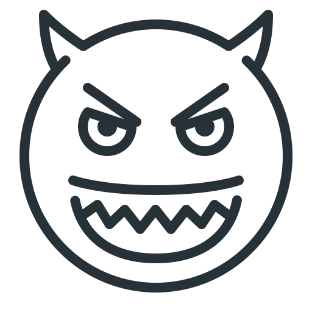
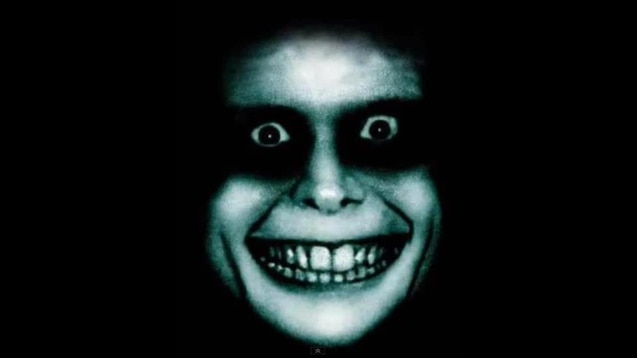

#  Laugh


Makes your voice assistant laugh like a maniac



## About

Laugh randomly or when requested.

## Settings

~/.config/ovos/skills/skill-laugh.openvoiceos/settings.json
~/.config/neon/skills/skill-laugh.openvoiceos/settings.json

```js
{
  "gender": "robot", // or "male" or "female"
  "haunted": false, // default true, "mine is an evil laugh"
  "sounds_dir": "/home/neon/venv/lib/python3.10/site-packages/skill_laugh/sounds", // default on a Neon setup, can be set to anything OVOS/Neon can access
  "__mycroft_skill_firstrun": false
}
```

## Examples

- "Laugh like Alexa"
- "can you laugh"

## Credits

- [@JarbasAl](https://jarbasal.github.io)
- [@mikejgray](https://graywind.org) (revival)
- [SoundBible](http://soundbible.com/suggest.php?q=laugh&x=0&y=0)
- [FreeSound](https://freesound.org/search/?q=female+evil+laugh)
- [0.jpg](https://pixabay.com/illustrations/ai-generated-woman-horror-monster-8960870/)
- [1.jpg](https://pixabay.com/illustrations/ai-generated-ghost-apparition-8960859/)
- [2.jpg](https://pixabay.com/photos/skull-skull-and-crossbones-skeleton-570975/)
- [3.jpg](https://pixabay.com/illustrations/ai-generated-halloween-ghost-horror-8307427/)

## Category

**Entertainment**

## Tags

#laugh
#funny
#entertainment
#repeating

## License

Apache-2.0
