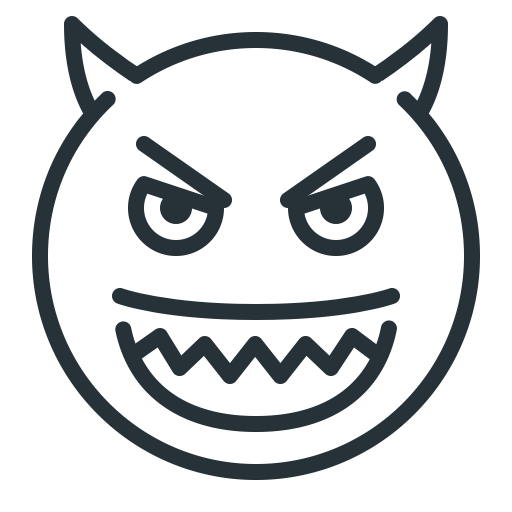

#  Laugh


This [OpenVoiceOS](https://github.com/OpenVoiceOS) skill plays a laugh sound through your voice assistant.


## About

The skill plays a laugh at random or when you ask for one. It picks a random sound from a set of male, female, or robot laughs.

## Install

```bash
pip install ovos-skill-laugh
```

## Settings

Edit the settings file for your platform:

- `~/.config/ovos/skills/skill-laugh.openvoiceos/settings.json`
- `~/.config/neon/skills/skill-laugh.openvoiceos/settings.json`

```js
{
  "gender": "robot", // or "male" or "female"
  "haunted": false, // default true, "mine is an evil laugh"
  "sounds_dir": "/home/neon/venv/lib/python3.10/site-packages/skill_laugh/sounds", // default on a Neon setup, can be set to anything OVOS/Neon can access
  "__mycroft_skill_firstrun": false
}
```

## Examples

- "Laugh like Alexa"
- "can you laugh"

## Related projects

- [OpenVoiceOS](https://github.com/OpenVoiceOS) — the org that maintains this skill and the wider voice assistant platform.

## Credits

- [@JarbasAl](https://jarbasal.github.io)
- [@mikejgray](https://graywind.org) (revival)
- [SoundBible](http://soundbible.com/suggest.php?q=laugh&x=0&y=0)
- [FreeSound](https://freesound.org/search/?q=female+evil+laugh)
- [Pixabay](https://pixabay.com/)

## Category

**Entertainment**

## Tags

#laugh
#funny
#entertainment
#repeating

## License

Apache-2.0
